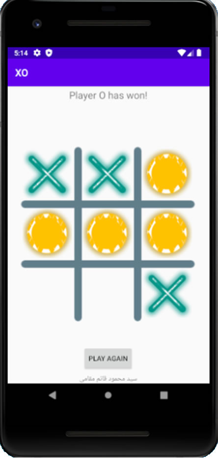

# XO Game Android Java


The app in this repository is my first app i shared in Github. I'm new in android I will share my apps in Github.
I will be happy for you to see them and share your thoughts with me.

## Discussion MainActivity.java

```java
int[][] winningSituations = {{0, 1, 2}, {3, 4, 5}, {6, 7, 8}, {0, 3, 6}, {1, 4, 7}, {2, 5, 8}, {0, 4, 8}, {2, 4, 6}};
```
Winning situations are:

* Horizontal first row : {0, 1, 2},
* Horizontal second row : {3, 4, 5},
* Horizontal third row : {6, 7, 8},
* Vertical first row : {0, 3, 6},
* Vertical second row : {1, 4, 7},
* Vertical third row : {2, 5, 8},
* Multiplication sign : {0, 4, 8},
* Multiplication sign : {2, 4, 6}

```java
for (int[] situations : winningSituations) {
        if (cellsStatus[situations[0]] == cellsStatus[situations[1]] && cellsStatus[situations[1]] == cellsStatus[situations[2]] && cellsStatus[situations[0]] != 0) {

            //if somebody won then gameActivity is false
            gameActivity = false;
            String winner = "";
            if (currentPlayer == 1) {
                winner = "Player X ";
            } else {
                winner = "Player O";
            }

            Button playAgainButton = (Button) findViewById(R.id.playAgainButton);
            TextView winnerTextView = (TextView) findViewById(R.id.summaryTextView);
            winnerTextView.setText(winner + " has won!");
            playAgainButton.setVisibility(View.VISIBLE);
            winnerTextView.setVisibility(View.VISIBLE);
        }
    }
}else{
    clearTableGame();
}
```
We check to see if array cells look like winning modes.

## Discussion activity_main.xml
In XML file we have a GridLayout with 9 ImageView:

```xml
<GridLayout
  android:id="@+id/gridLayout"
  android:layout_width="368dp"
  android:layout_height="368dp"
  android:layout_marginStart="8dp"
  android:layout_marginTop="8dp"
  android:layout_marginEnd="8dp"
  android:layout_marginBottom="8dp"
  android:background="@drawable/table_game"
  android:columnCount="3"
  android:rowCount="3"
  app:layout_constraintBottom_toBottomOf="parent"
  app:layout_constraintEnd_toEndOf="parent"
  app:layout_constraintStart_toStartOf="parent"
  app:layout_constraintTop_toTopOf="parent">
  <ImageView
      android:id="@+id/imageView1"
      android:layout_width="100dp"
      android:layout_height="100dp"
      android:layout_margin="10dp"
      android:onClick="pushDice"
      android:tag="0" />
  
  .
  .
  .
  ```
That`s it!

I will share another project about Object Oriented Programming in Android Stodio you can see in this [repository](https://github.com/mahmood-ghaem/AndroidStudio_OOP)

## License
```
Copyright Sayed Mahmood Ghaem Maghami April 08, 2020.

```
